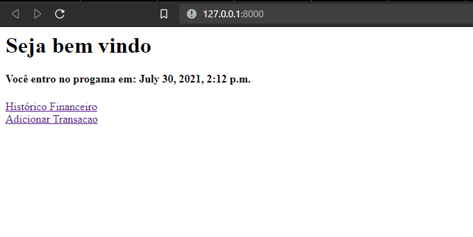
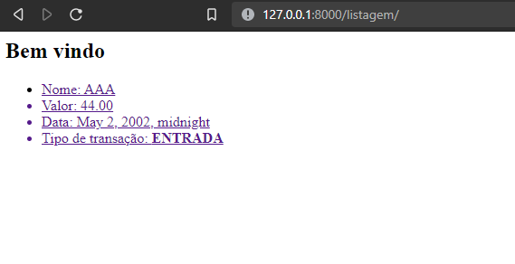
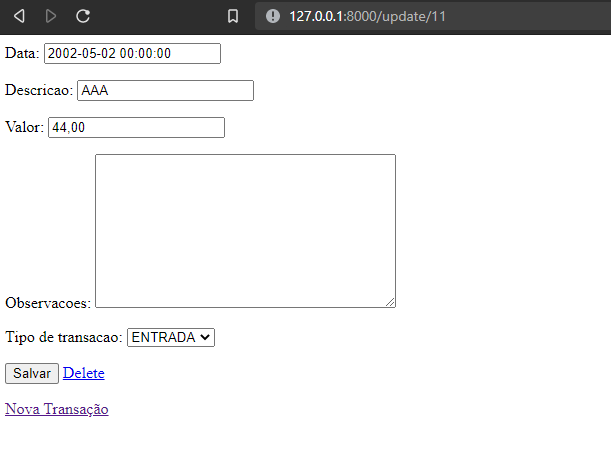

# Prints







# Getting Started
```bash
> git clone https://github.com/Mesheo/first-crud-django.git && cd first-crud-django
> ./venv/Scripts/Activate.ps1
> python manage.py runserver
```

Ctrl click on http://127.0.0.1:8000/ and you will render the html that interact with the CREATE, READ, UPDATE, DELETE actions of the application. 

